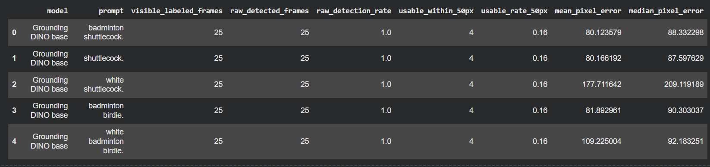
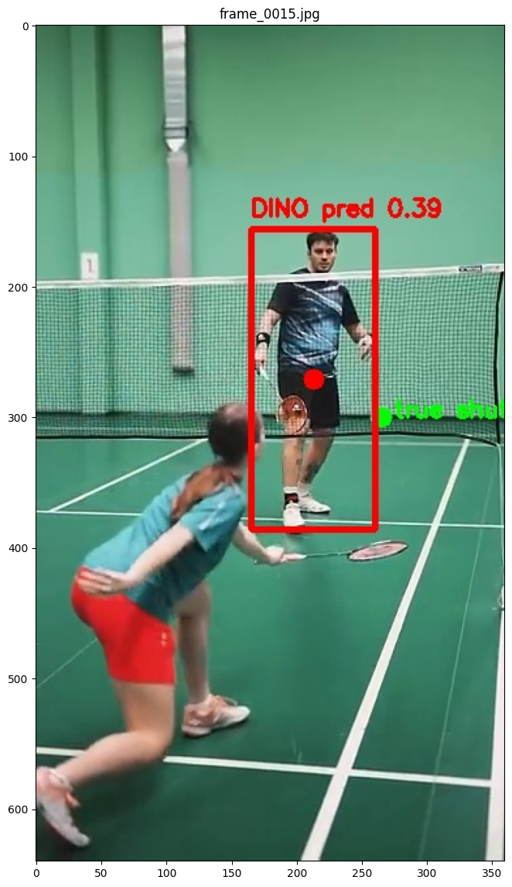
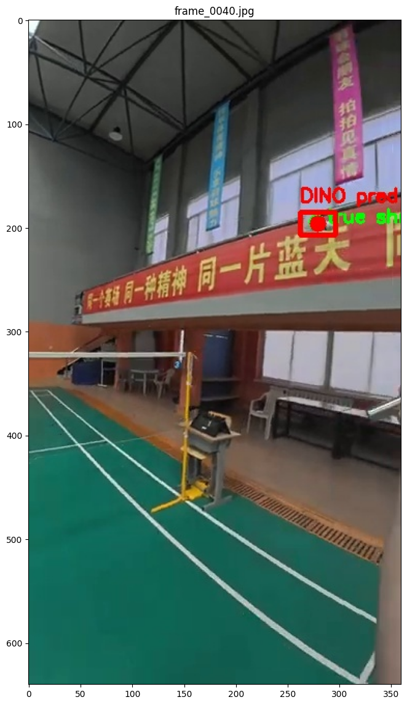

# DINO Badminton Object Detection

Preliminary frame-level evaluation of Grounding DINO for badminton shuttlecock detection.

This project tests whether a pretrained Grounding DINO model can locate a badminton shuttlecock in extracted video frames. The goal was to output the shuttlecock center pixel coordinates `(u, v)` for each frame and compare them against manually labeled shuttle centers.

## What I did

- Extracted frames from badminton footage
- Manually labeled the shuttlecock center in selected frames
- Ran pretrained Grounding DINO with multiple prompts, including:
  - `badminton shuttlecock`
  - `shuttlecock`
  - `white shuttlecock`
  - `badminton birdie`
  - `white badminton birdie`
- Converted DINO bounding boxes into center points
- Compared predicted centers against manual labels using pixel error
- Visualized predictions with:
  - green dot = manually labeled shuttle center
  - red box/dot = DINO prediction

## Results

Grounding DINO was able to return bounding boxes, but the boxes were often not centered on the actual shuttlecock. In the cleaner test set, the best prompt only produced usable detections within 50 pixels on about 16% of labeled frames.

## Takeaway

Zero-shot Grounding DINO alone does not appear reliable enough for badminton shuttlecock pixel localization. It may be useful as a baseline, but tracking-specific approaches such as TrackNet, or simpler HSV/motion-based baselines, are likely better directions for this task.

## Sample Results

Prompt sweep summary:

Example DINO failure case:

Green dot = manually labeled shuttle center.  
Red box/dot = Grounding DINO prediction.

Example closer detection:

This was a quick proof-of-concept evaluation, not a trained detector. No model fine-tuning was perfo
